# Umain Launcher

A minimal, working Android home launcher built with **Kotlin + Jetpack Compose**,
inspired by [NoLagLauncher](https://github.com/M1nexoff/NoLagLauncher).

It shows what actually turns an app into a *launcher* and keeps everything else
as small as possible:

- A wallpaper-facing **home screen** with a live clock and a **favorites dock**.
- A **swipe-up app drawer** with a grid searchable by label *or* package name.
- Tap to launch; **long-press** for App info, copy package name, pin, hide or uninstall.
- **Multi-select mode** to hide or uninstall several apps at once.
- **Hidden apps** persist (DataStore) and can be revealed with a toggle.

- **Settings** (long-press the home screen, or the gear in the drawer): **layout**
  (icon grid or a **Minimal AF** text-only list — names, no icons), grid columns,
  icon size, icon **shape** (circle / squircle / rounded) and **color filter**
  (grayscale / desaturated / sepia), theme (system/light/dark, Material You **or**
  a preset accent), and wallpaper (system picker or pick-and-apply).
- **Movable home widgets** — the clock, favorites dock and a **status widget**
  (battery / storage / memory) are each draggable, snap to a grid, and resize via a
  corner handle. Positions persist; "Reset home layout" in Settings › Home.
- **System app widgets** — host third-party home-screen widgets via `AppWidgetHost`.
  Add from Settings › Home › *Add widget*; move (handle), resize and remove (×) like
  the built-in widgets. Bindings and placement persist.

Dev/pentest oriented:

- **Activity Launcher / package inspector** — inspect a package (version, SDK levels,
  **signing SHA-256**, installer source, `debuggable`/`cleartext`/`allowBackup`/`system`
  flags, **permissions with grant state + protection level**, **exported components**),
  **export its APK**, and fire any of its activities directly.
- **Dev shortcuts** — quick chips into Developer options, Device info and Settings.

> The full step-by-step tutorial lives in [`posts/`](posts/) — in
> [English](posts/how-to-build-an-android-launcher.en.md) and
> [Português-BR](posts/como-criar-um-launcher-android.pt-BR.md).

## Screenshots

Captured on a Samsung Galaxy A34 (Android 16, One UI 8) running the debug build as
the default home app.

### Home & drawer

| Home screen | App drawer | Package search |
|:---:|:---:|:---:|
| 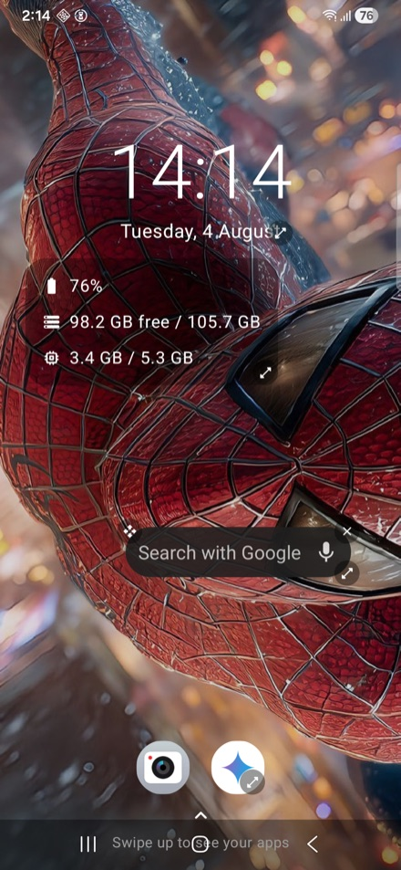 | 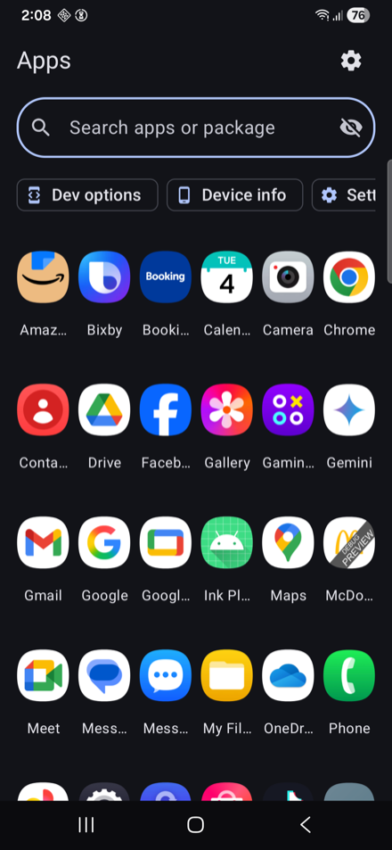 | 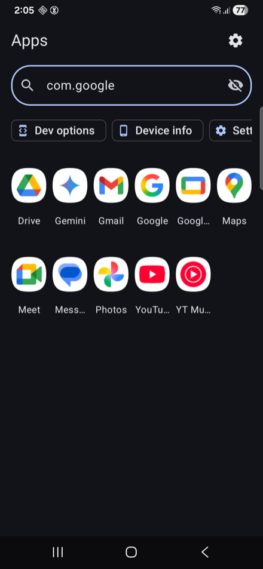 |
| Live clock, the battery/storage/memory **status widget**, a hosted **system app widget**, and the favorites dock — each movable and resizable. | Searchable grid with **Dev options / Device info / Settings** shortcut chips. | The search box matches the **package name**, not just the label. |

### App actions

| Long-press actions | Multi-select | Minimal layout |
|:---:|:---:|:---:|
| 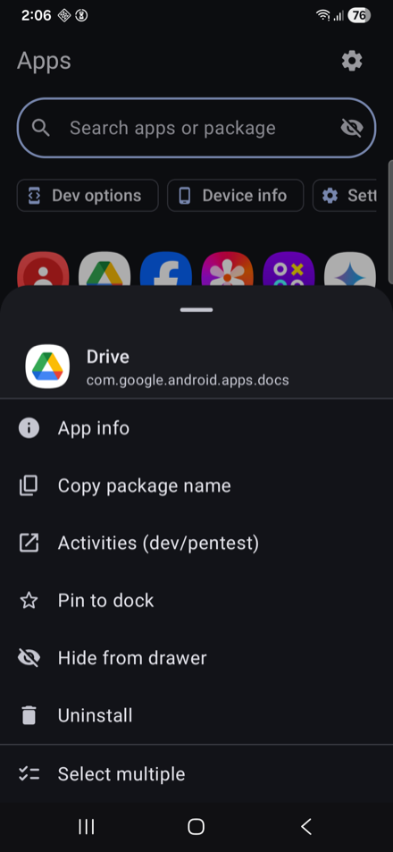 | 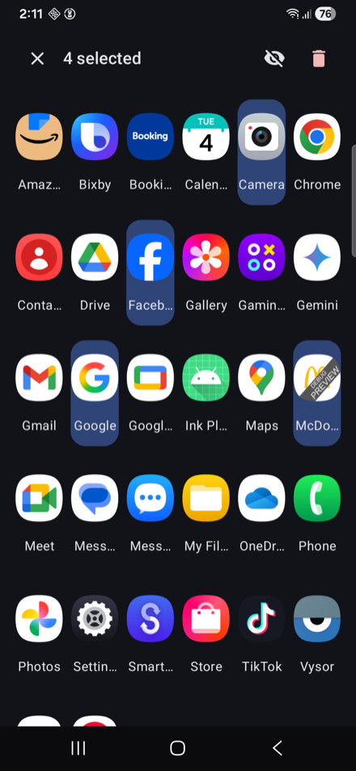 | 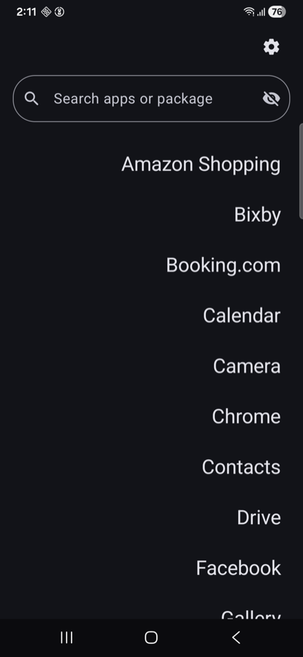 |
| App info, copy package name, activity launcher, pin, hide, uninstall. | Hide or uninstall several apps in one pass. | **Minimal AF** — names only, no icons. |

### Settings

| Layout & icons | Theme, home & wallpaper | Widget picker |
|:---:|:---:|:---:|
| 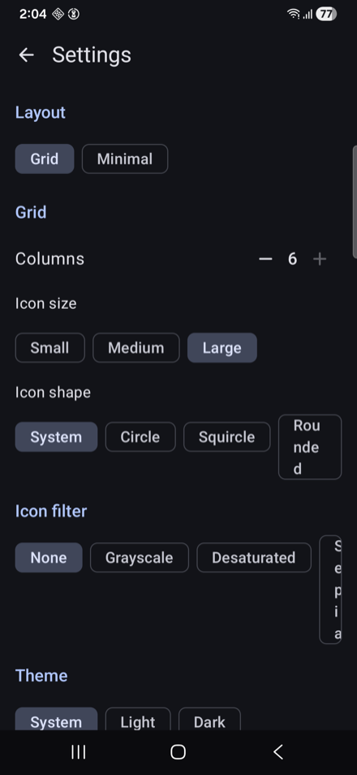 | 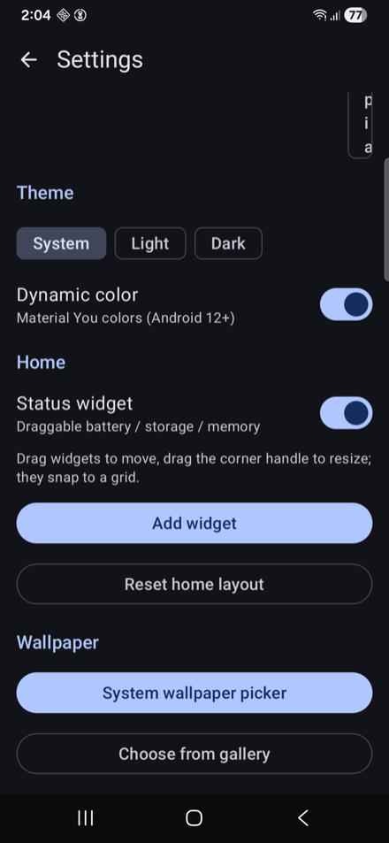 | 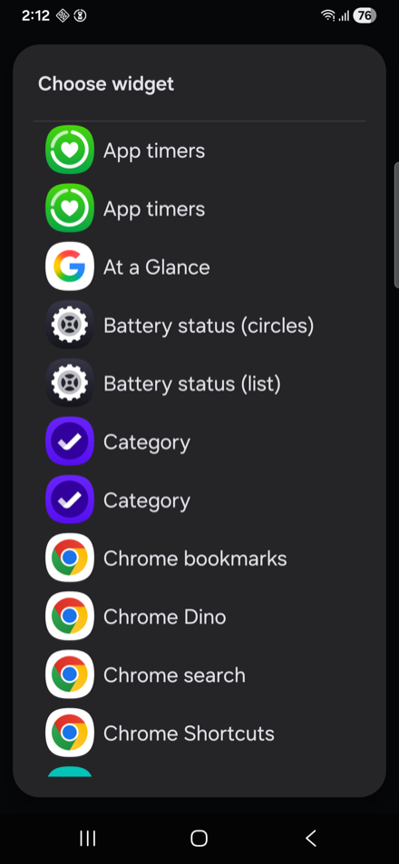 |
| Grid or Minimal, columns, icon size, **shape** and **color filter**. | Theme mode, Material You, home-layout controls and wallpaper. | *Add widget* lists every installed `AppWidgetProvider`. |

### Dev / pentest tools

| Package inspector | Permissions | Activity launcher |
|:---:|:---:|:---:|
| 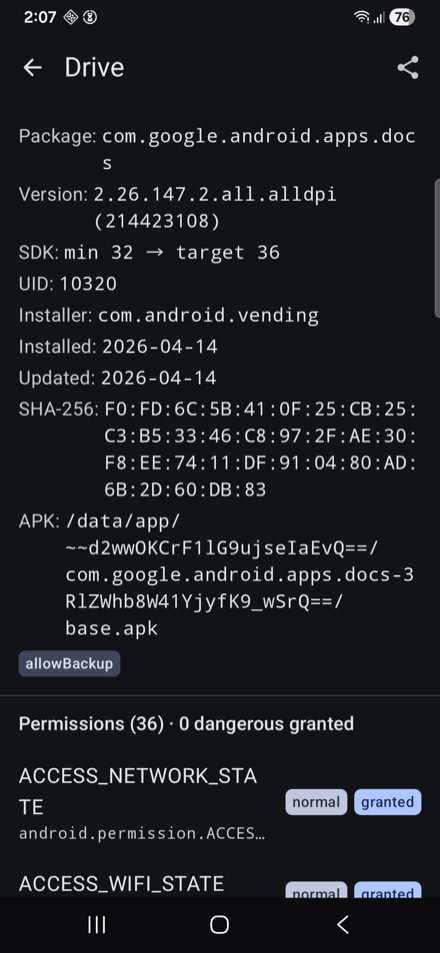 | 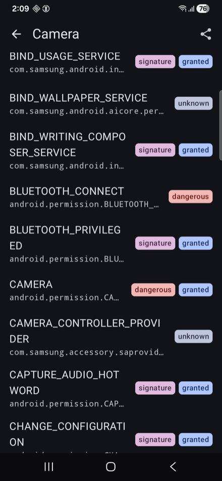 | 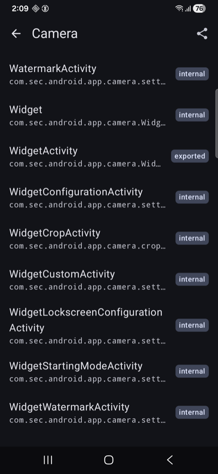 |
| Version, SDK levels, UID, installer, dates, **signing SHA-256**, APK path, manifest flags. | Every requested permission with its **protection level** and **grant state**. | Fire any activity directly; `exported` vs `internal` is called out. |

## Requirements

Verified against the current stable toolchain (July 2026):

| Tool | Version |
|------|---------|
| Android Studio | Quail 1 (2026.1.1) or newer |
| Android Gradle Plugin (AGP) | 9.2.1 |
| Gradle | 9.6.1 |
| Kotlin | 2.4.10 (bundled via AGP's built-in Kotlin) |
| Compose BOM | 2026.06.01 |
| JDK | 17+ (the bundled Android Studio JBR works) |
| compileSdk / targetSdk | 37 · minSdk 26 (Android 8.0+) |
| SDK Build Tools | 36.0.0 |

## Run it

1. Open the project in Android Studio and let it sync.
2. Run the `app` configuration on an emulator or device.

From the command line (SDK configured in `local.properties`):

```bash
./gradlew installDebug        # build + install on the connected device
```

Installing only puts the app on the device — it does **not** take over the home screen.
For that, see below.

## Set it as the default launcher

> [!WARNING]
> **Keep a second launcher installed.** This app declares `category.HOME`, so it can
> become the *only* home app on the device. If it is the only one and it crashes or you
> uninstall it, you can be left with no way back to a home screen. Stock launchers
> (One UI Home, Pixel Launcher) are system apps and can't be uninstalled, so on a normal
> phone you already have a fallback — just don't test this on a device where you removed it.

Any of these three routes works — pick whichever is handiest.

**1 · The Home button prompt.** Press **Home**. If more than one launcher is installed,
Android asks which to use: pick **Umain Launcher**, then **Always**. On some builds
(One UI included) pressing Home goes straight to the current launcher without asking —
use route 2 there.

**2 · Settings.** Open **Settings**, search for **Default apps**, then **Home app** →
**Umain Launcher**. Searching avoids guessing, because the breadcrumb differs per skin;
on One UI 8 it is **Settings → Apps → Choose default apps → Home app**. Either way you
land on the screen below, titled **Default home app**:

<p align="center">
  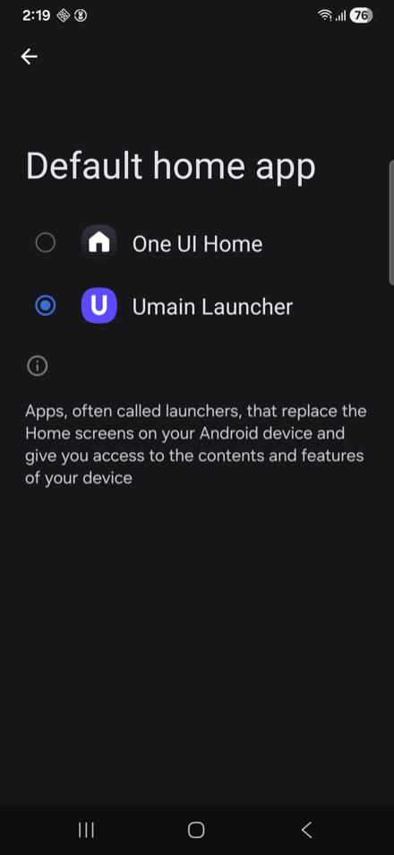
</p>

**3 · adb** — no tapping, handy while iterating:

```bash
adb shell cmd package set-home-activity com.umain.launcher/.MainActivity
```

It prints `Success` once the role is reassigned. To jump straight to the picker instead:

```bash
adb shell am start -a android.settings.HOME_SETTINGS
```

### Going back to your normal launcher

Use the same **Default home app** screen and pick your previous launcher (**One UI Home**,
**Pixel Launcher**, …). Or via adb, passing that launcher's component:

```bash
# One UI Home (Samsung)
adb shell cmd package set-home-activity \
  com.sec.android.app.launcher/.activities.LauncherActivity

# Pixel Launcher
adb shell cmd package set-home-activity \
  com.google.android.apps.nexuslauncher/.NexusLauncherActivity
```

Not sure of the component? List every home activity on the device — the raw dump is very
verbose, so filter it down:

```bash
adb shell cmd package query-activities \
  -a android.intent.action.MAIN -c android.intent.category.HOME |
  grep -E '^\s+(packageName|name)=' | grep -v Application
```

Each launcher shows up as a `name=` / `packageName=` pair; join them as
`packageName/name` to get the component. `com.android.settings.FallbackHome` is the
system's own stub — ignore it.

And to check which launcher currently holds the role:

```bash
adb shell cmd package resolve-activity \
  -a android.intent.action.MAIN -c android.intent.category.HOME | grep -m1 packageName=
```

Uninstalling Umain Launcher also hands the home role back to the remaining launcher.

## Project layout

```
app/src/main/
├── AndroidManifest.xml           # HOME intent-filter + <queries> — this is what makes it a launcher
├── java/com/umain/launcher/
│   ├── MainActivity.kt           # single Activity, hosts Compose
│   ├── data/
│   │   ├── AppInfo.kt            # one launchable app
│   │   └── AppRepository.kt      # queries + launches apps via PackageManager
│   └── ui/
│       ├── HomeViewModel.kt      # holds the app list (StateFlow)
│       ├── LauncherRoot.kt       # home + drawer composition
│       ├── HomeScreen.kt         # clock + swipe-up gesture
│       ├── AppDrawer.kt          # searchable app grid
│       └── theme/                # Material 3 theme
└── res/                          # icons, strings, launcher theme (transparent → wallpaper shows)
```

## License

Sample/demo code for the accompanying blog post. Use freely.
